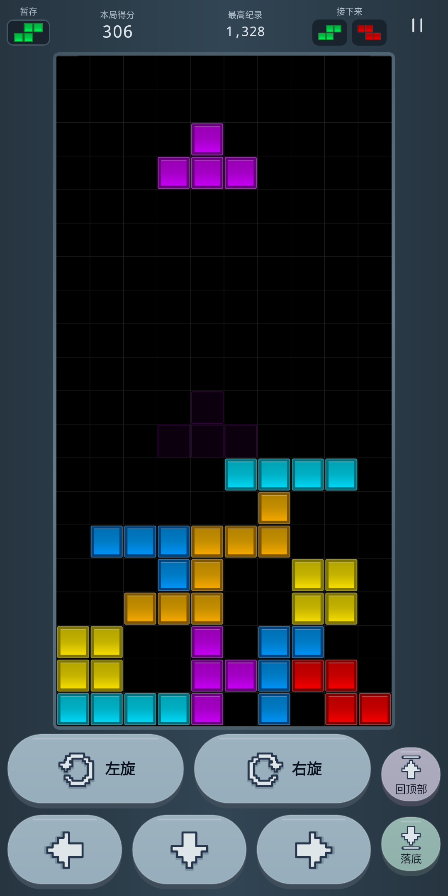

# 微光游乐场 · Aurora Arcade

原生安卓小游戏合集，首版包含完整的俄罗斯方块。支持离线、时光回退、经典挑战、自动保存和可调手感。

## 安装

从 [Release 0.1](https://github.com/enkidu-214/aurora-arcade/releases/tag/v0.1) 下载 `aurora-arcade-0.1.apk`，发送到 Android 手机后点击安装。安装包经过 R8 优化，使用独立发布签名，无需网络、登录或账号。校验文件为同页的 `SHA256SUMS`。

最低系统 Android 8.0（API 26），编译 / 目标系统 Android 16（API 36）。具体实测设备和流畅度结果见 [0.1 验证记录](docs/release-0.1-verification.md)。

如果安装过发布前的本地测试包，因为签名不同，需要先卸载测试包再安装此版本；卸载会清除本地对局和记录。之后的正式版本保留同一发布签名，可直接覆盖升级。

## 操作

- 左 / 右：按下立即移动；长按连续移动。
- 向下：按住加速下降。
- 两个旋转键：逆时针 / 顺时针旋转，支持 SRS 贴墙修正。
- 快速落底：立即锁定当前方块。
- 暂存：点击顶部暂存格，每次落子前限一次。
- 撤回到顶部：只把刚刚快速落底的这一块送回顶部中央，以初始朝向重新摆放。只能撤回这一块，不能连续撤回更早的方块。若本块触发消行，棋盘和分数也会恢复。
- 错误落子导致失败时，仍可在结束窗口撤回。自然落子会使前一次硬降的回退机会失效。
- 经典模式关闭回退，两种模式分别保存最高分。
- 切到后台或失去窗口焦点会暂停，返回后点击继续。

外接键盘：方向键移动（上键顺时针），Z/X 旋转，空格快速落底，C/左 Shift 暂存，U/退格撤回，Esc 暂停。

## 手感与动画

底部主操作键采用两排柔和蓝灰色圆形 / 胶囊按钮：上排左旋 / 右旋，下排左移 / 加速下降 / 右移，高度均为 68 dp。「回顶部」与「落底」放在操作区右侧，使用 56 × 54 dp 的小按钮。操作图标采用不带表情的像素风箭头，回顶部 / 落底分别有顶线 / 底线标记；按钮保留完整点击区域及按压回弹。

游戏界面优先展示棋盘：取消独立标题行，暂存、本局得分、最高纪录、两个后续方块和暂停按钮合并为一排。左右外边距缩至 6 dp，并收紧棋盘和按键之间的间距。游戏时自动隐藏系统栏，从边缘滑动可临时唤出，返回首页恢复系统栏。棋盘按完整 10 × 20 正方格与外框计算最大可用尺寸；两排主操作键仍高 68 dp。

默认长按延迟 140ms、重复间隔 40ms；开启「灵敏操控」后为 100ms / 28ms。软降间隔 35ms。普通触底调整时间 500ms，最多重置 15 次；硬降立即锁定。

规则计算不依赖屏幕帧率。Canvas 通过 Compose 帧时钟更新，输入立即修改逻辑位置，视觉位置做短距离平滑过渡。包括玻璃方块、落点轮廓、旋转过渡、落底光轨、消行碎片和回退上溯。设置中可关闭音效、振动或动态效果。

方块已去掉所有装饰花纹，使用 [Tetris 官网网页版](https://play.tetris.com/) 游戏内普通方块贴图的实际采样色。官网方块是渐变材质，并非单一纯色；以下为贴图中心色，明暗边缘也使用同一贴图的采样值。棋盘、活动块、暂存、后续预览和首页展示共用 Canvas 绘制，无新增贴图。

| 方块 | 颜色 | 中心色 |
| --- | --- | --- |
| I | 青色 | `#00B0C5` |
| O | 黄色 | `#C5B300` |
| T | 紫色 | `#A400C5` |
| S | 绿色 | `#00C546` |
| Z | 红色 | `#C50000` |
| J | 蓝色 | `#007BC5` |
| L | 橙色 | `#C58E00` |

游戏外围采用柔和的深蓝灰渐变（`#263540` 到 `#324554`），搭配低亮度蓝灰边框、灰白文字和同色系主按钮；回顶部 / 落底只用低饱和淡紫与灰绿轻微区分。按钮高光已减弱，避免大面积白色和亮边。七种方块仍使用官网取样色，棋盘保留黑底灰网格。方块色值与采样位置见 [配色记录](docs/official-colors.md)。



小屏大字体效果见 [截图](docs/screenshots/large-board-small.png)。

## 构建

使用 Android Studio 打开当前目录，选择 JDK 17 或 21，安装 Android SDK 36 与 Build Tools 36.0.0，同步后运行 `app`。

命令行：

```sh
./gradlew :core:test :app:lintRelease :app:assembleRelease
```

本机可使用 `bash scripts/build-local.sh` 自动选择兼容的 JDK 与项目本地 SDK。仓库提供 [GitHub Actions 配置模板](docs/ci/android.yml)，当前授权不包含工作流写入权限，因此尚未启用自动构建。签名私钥不会上传到 GitHub。

Windows 使用 `gradlew.bat`。首次构建需要下载 Gradle 和 Maven 依赖。SDK 路径由 Android Studio 写入 `local.properties`，或设置 `ANDROID_HOME`。

- Gradle 8.11.1 / Android Gradle Plugin 8.10.1
- Kotlin 2.1.20 / Compose BOM 2025.04.01
- minSdk 26 / compileSdk、targetSdk 36
- 无签名优化安装包：`app/build/outputs/apk/release/app-release-unsigned.apk`
- 配置私有签名后输出：`app/build/outputs/apk/release/app-release.apk`；签名说明见 [发布说明](docs/releasing.md)
- 调试安装包：运行 `./gradlew :app:assembleDebug`，输出 `app/build/outputs/apk/debug/app-debug.apk`

本次本地构建工具位于忽略目录 `.toolchain/`，不是应用的一部分。换电脑只需正常配置 JDK 和 Android SDK，无需复制该目录。

## 工程结构

- `core/`：纯 Kotlin 引擎、SRS、出块器、撤回快照、输入重复调度、版本化存档、JUnit 测试。
- `app/`：Compose 页面、Canvas 渲染、原生声音/触感、Android 生命周期、设置与记录。
- `docs/superpowers/`：设计说明与执行计划。
- `docs/verification.md`：构建、测试、运行验证记录与边界。
- `docs/gameplay.mp4`：安卓模拟器中的消行与单步撤回演示。
- `docs/screenshots/`：正常屏幕、小屏幕和大字体的界面截图。
- `releases/`：本地安装包及校验；APK 通过 GitHub Release 分发，不存入 Git。

## 计分与保存

普通消行 1/2/3/4 行获得 100/300/500/800 × 当前等级，连续消行获得额外奖励。软降每格 1 分，硬降每格 2 分，只在落子时结算；回退会撤销本块全部收益。每 10 行升一级。

存档包含出块随机状态、锁定计时与回退快照，使用带 CRC 校验的版本化格式，所有读写由进程内单一队列排序并原子替换，避免快速暂停、重建或退出后出现旧状态。最高分不提前计入仍可撤销的最后一次落子。
